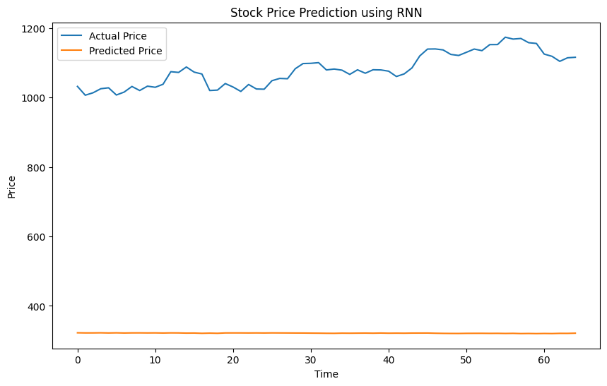

# DL- Developing a Recurrent Neural Network Model for Stock Prediction

## AIM
To develop a Recurrent Neural Network (RNN) model for predicting stock prices using historical closing price data.

## Problem Statement and Dataset
## Problem Statement and Dataset
A Recurrent Neural Network (RNN) is a type of deep learning model designed to handle sequential data, such as time series like stock prices. It processes previous inputs through loops, allowing it to capture temporal dependencies and patterns over time. When used for stock price prediction, the RNN analyzes historical price data to learn trends and make future price estimates. Its ability to remember information across sequences makes it suitable for modeling the dynamic and seasonal nature of stock markets. Overall, RNNs help improve forecast accuracy by leveraging past data to inform future predictions.


## DESIGN STEPS
### STEP 1: 

Load and normalize data, create sequences.

### STEP 2: 
Convert data to tensors and set up DataLoader.  

### STEP 3: 

Define the RNN model architecture.

### STEP 4: 

Summarize, compile with loss and optimizer.

### STEP 5: 
Train the model with loss tracking.

### STEP 6: 

Predict on test data, plot actual vs. predicted prices.


## PROGRAM

### Name: SUDHARSAN S

### Register Number:212224040334

```python
import numpy as np
import pandas as pd
import matplotlib.pyplot as plt
from sklearn.preprocessing import MinMaxScaler
import torch
import torch.nn as nn
from torch.utils.data import DataLoader, TensorDataset
```


```python
## Step 1: Load and Preprocess Data
# Load training and test datasets
df_train = pd.read_csv('trainset.csv')
df_test = pd.read_csv('testset.csv')
```


```python
# Use closing prices
train_prices = df_train['Close'].values.reshape(-1, 1)
test_prices = df_test['Close'].values.reshape(-1, 1)
```


```python
# Normalize the data based on training set only
scaler = MinMaxScaler()
scaled_train = scaler.fit_transform(train_prices)
scaled_test = scaler.transform(test_prices)
```


```python
# Create sequences
def create_sequences(data, seq_length):
    x = []
    y = []
    for i in range(len(data) - seq_length):
        x.append(data[i:i+seq_length])
        y.append(data[i+seq_length])
    return np.array(x), np.array(y)

seq_length = 60
x_train, y_train = create_sequences(scaled_train, seq_length)
x_test, y_test = create_sequences(scaled_test, seq_length)

```


```python
x_train.shape, y_train.shape, x_test.shape, y_test.shape
```


    ((1199, 60, 1), (1199, 1), (65, 60, 1), (65, 1))


```python
# Convert to PyTorch tensors
x_train_tensor = torch.tensor(x_train, dtype=torch.float32)
y_train_tensor = torch.tensor(y_train, dtype=torch.float32)
x_test_tensor = torch.tensor(x_test, dtype=torch.float32)
y_test_tensor = torch.tensor(y_test, dtype=torch.float32)

```


```python
# Create dataset and dataloader
train_dataset = TensorDataset(x_train_tensor, y_train_tensor)
train_loader = DataLoader(train_dataset, batch_size=64, shuffle=True)
```


```python
class RNNModel(nn.Module):
    def __init__(self, input_size=1, hidden_size=64, num_layers=2, output_size=1):
        super(RNNModel, self).__init__()
        self.rnn = nn.RNN(input_size, hidden_size, num_layers, batch_first=True)
        self.fc = nn.Linear(hidden_size, output_size)

    def forward(self, x):
        out, _ = self.rnn(x)
        out = self.fc(out[:, -1, :])
        return out
```


```python
model = RNNModel()
device = torch.device("cuda" if torch.cuda.is_available() else "cpu")
model = model.to(device)
```


```python
!pip install torchinfo
```

    Collecting torchinfo
      Downloading torchinfo-1.8.0-py3-none-any.whl.metadata (21 kB)
    Downloading torchinfo-1.8.0-py3-none-any.whl (23 kB)
    Installing collected packages: torchinfo
    Successfully installed torchinfo-1.8.0
    


```python
from torchinfo import summary

# input_size = (batch_size, seq_len, input_size)
summary(model, input_size=(64, 60, 1))
```


```

    ==========================================================================================
    Layer (type:depth-idx)                   Output Shape              Param #
    ==========================================================================================
    RNNModel                                 [64, 1]                   --
    ├─RNN: 1-1                               [64, 60, 64]              12,608
    ├─Linear: 1-2                            [64, 1]                   65
    ==========================================================================================
    Total params: 12,673
    Trainable params: 12,673
    Non-trainable params: 0
    Total mult-adds (Units.MEGABYTES): 48.42
    ==========================================================================================
    Input size (MB): 0.02
    Forward/backward pass size (MB): 1.97
    Params size (MB): 0.05
    Estimated Total Size (MB): 2.03
    ==========================================================================================


```

```python
criterion = nn.MSELoss()
optimizer = torch.optim.Adam(model.parameters(), lr=0.001)
```


```python
## Training Loop
def train_model(model, train_loader, criterion, optimizer, epochs=20):
    train_losses = []
    model.train()

    for epoch in range(epochs):
        total_loss = 0

        for x_batch, y_batch in train_loader:
            x_batch, y_batch = x_batch.to(device), y_batch.to(device)

            optimizer.zero_grad()  # Clear previous gradients
            outputs = model(x_batch)  # Forward pass
            loss = criterion(outputs, y_batch)  # Compute loss
            loss.backward()  # Backpropagation
            optimizer.step()  # Update weights

            total_loss += loss.item()

        train_losses.append(total_loss / len(train_loader))
        print(f'Epoch [{epoch+1}/{epochs}], Loss: {total_loss / len(train_loader):.4f}')
        # Plot training loss
        print('Name:                 SUDHARSAN S')
        print('Register Number:     212224040334')
        plt.plot(train_losses, label='Training Loss')
        plt.xlabel('Epoch')
        plt.ylabel('MSE Loss')
        plt.title('Training Loss Over Epochs')
        plt.legend()
        plt.show()
```


```python
## Step 4: Make Predictions on Test Set
model.eval()
with torch.no_grad():
    predicted = model(x_test_tensor.to(device)).cpu().numpy()
    actual = y_test_tensor.cpu().numpy()

# Inverse transform the predictions and actual values
predicted_prices = scaler.inverse_transform(predicted)
actual_prices = scaler.inverse_transform(actual)

# Plot the predictions vs actual prices
print('Name:                 SUDHARSAN S')
print('Register Number:     212224040334')
plt.figure(figsize=(10, 6))
plt.plot(actual_prices, label='Actual Price')
plt.plot(predicted_prices, label='Predicted Price')
plt.xlabel('Time')
plt.ylabel('Price')
plt.title('Stock Price Prediction using RNN')
plt.legend()
plt.show()
print(f'Predicted Price: {predicted_prices[-1]}')
print(f'Actual Price: {actual_prices[-1]}')
```
```
    Name:                 SUDHARSAN S
    Register Number:     212224040334
    

```
    

    
```

    Predicted Price: [321.2613]
    Actual Price: [1115.65]
    

```


### OUTPUT

## Training Loss Over Epochs Plot


## True Stock Price, Predicted Stock Price vs time


### Predictions


## RESULT
Thus, a Recurrent Neural Network (RNN) model for predicting stock prices using historical closing price data has been developed successfully.

## True Stock Price, Predicted Stock Price vs time


### Predictions


## RESULT
Thus, a Recurrent Neural Network (RNN) model for predicting stock prices using historical closing price data has been developed successfully.
